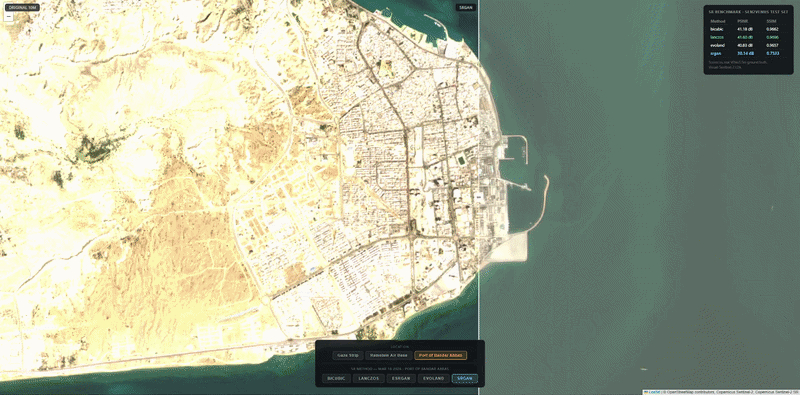
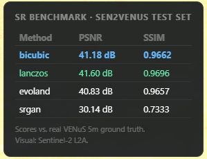
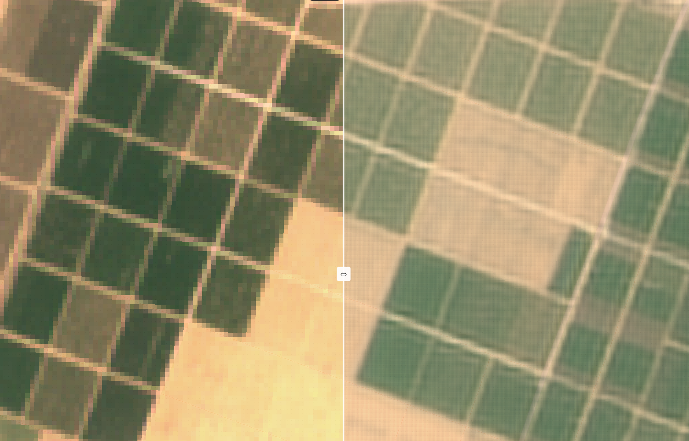
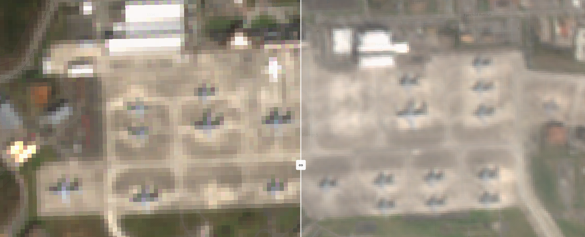
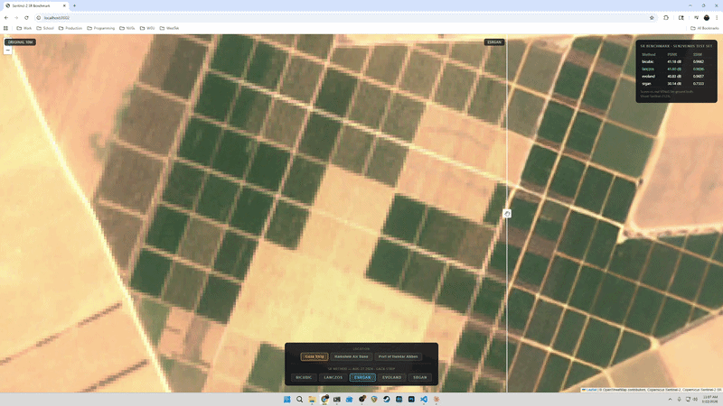
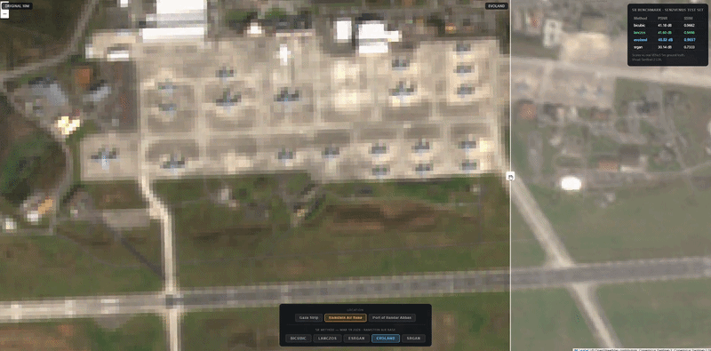

# Sentinel-2 Super-Resolution Benchmark

Benchmarks and visual comparison of super-resolution techniques applied to Sentinel-2 L2A satellite imagery over three strategically significant locations. Includes classical interpolation, a satellite-domain CNN, a general-purpose GAN, and a custom model trained from scratch on paired satellite data.


*Qeshm Island, Strait of Hormuz — Sentinel-2 10m native (left) vs custom SRGAN 4× output (right)*

---

## Scenes

| Location | Date | MGRS Tile | Notes |
|---|---|---|---|
| Gaza Strip | Aug 27, 2024 | T36RXV | Peak damage scene during active conflict |
| Ramstein Air Base | Mar 19, 2026 | T32ULV | USAF's largest overseas air base (Rhineland-Palatinate) |
| Port of Bandar Abbas | Mar 18, 2026 | T40RDQ | Iran's primary naval/commercial port on the Strait of Hormuz |

All scenes are Sentinel-2 L2A (10m, atmospherically corrected), downloaded from the Copernicus OData API.

---

## SR Methods

| Method | Type | Scale | PSNR | SSIM |
|---|---|---|---|---|
| Bicubic | Classical interpolation | 2× | 41.18 dB | 0.9662 |
| Lanczos | Classical interpolation | 2× | 41.60 dB | 0.9696 |
| EVOLAND (`s2v2x2_spatrad`) | CNN trained on Sentinel-2/VENµS pairs | 2× | 40.83 dB | 0.9657 |
| Real-ESRGAN x2plus | GAN trained on natural images | 2× | 45.32 dB | 0.9552 |
| OpenSR-SRGAN (custom) | RRDB-ESRGAN trained on SEN2NAIP | 4× | 31.65 dB | 0.7571 |

Benchmark scores computed on 60 test patches from the SEN2VENµS dataset (Amazon rainforest site, 128×128px patches). See [Benchmark Notes](#benchmark-notes).



---

## Visual Comparisons

### Agricultural fields — 10m native vs SRGAN 4×



The pixelation of individual field rows at native 10m resolution (left) vs. sub-field structure resolved by the 4× SRGAN (right). Note the finer boundary detail between crop types.

### Military installation — 10m native vs EVOLAND 2×



Vehicle and structure detail on a military ramp. EVOLAND uses raw reflectance bands (B02/B03/B04/B08) as input rather than the pre-rendered TCI, giving it access to radiometrically uncorrupted data.

### Real-ESRGAN — animated swipe compare



### Ramstein Air Base — scene selector



---

## Models

**Bicubic / Lanczos** — classical pixel interpolation using fixed convolution kernels. No parameters. Fast, deterministic, strong PSNR baselines.

**EVOLAND** ([sentinel2_superresolution](https://framagit.org/jmichel-otb/sentinel2_superresolution)) — a CARN (Cascading Residual Network) trained on paired Sentinel-2 (10m) / VENµS (5m) acquisitions. Takes raw reflectance bands B02/B03/B04/B08 as input. Developed by CESBIO/CNES. Inference via ONNX (`s2v2x2_spatrad.onnx`), tiles processed with 33px reflect-padded margins to suppress boundary artifacts.

**Real-ESRGAN x2plus** — residual-in-residual dense block GAN trained on natural images with synthetic degradation. Not satellite-specific — applies learned natural image priors to any RGB input. Higher PSNR than satellite-specific models on this benchmark but lower SSIM, reflecting the GAN tradeoff: synthesizes sharp perceptual detail that diverges from ground truth pixel-for-pixel. GPU inference via PyTorch.

**OpenSR-SRGAN (custom)** — RRDB-ESRGAN generator with a PatchGAN discriminator, trained from scratch on the [SEN2NAIP](https://huggingface.co/datasets/isp-uv-es/SEN2NAIP) dataset (8,000 paired Sentinel-2 / NAIP samples). 4× scale (10m → 2.5m equivalent). Trained with PyTorch Lightning + WandB monitoring; best checkpoint at epoch 32 of 79.

The SRGAN's lower PSNR reflects two factors: (1) it is solving a harder 4× task vs. the other methods' 2×, making pixel-accurate reconstruction fundamentally more difficult; (2) adversarial training intentionally trades PSNR for perceptual sharpness — GAN outputs are penalized by PSNR metrics for synthesizing plausible high-frequency detail that doesn't match ground truth exactly. The discriminator showed dominance from early training (a known GAN instability); retraining with longer generator pre-training is a documented next step.

---

## Benchmark Notes

- Ground truth: VENµS 5m imagery from the [SEN2VENµS dataset](https://zenodo.org/record/6514159)
- VENµS was a joint ESA/ISA mission designed as Sentinel-2's high-resolution companion, with matched spectral bands and coordinated acquisition schedules
- Test set: 60 patches from the FGMANAUS (Amazon rainforest) site
- EVOLAND scores should be interpreted cautiously — its training data overlap with SEN2VENµS is not fully documented
- Benchmark terrain (Amazon rainforest) differs from displayed imagery (arid urban, European airfield, coastal port) — scores are valid for relative comparison but not terrain-matched validation
- SRGAN is benchmarked at 4× on the same test patches; direct PSNR comparison with 2× methods is not apples-to-apples

---

## Training

The custom SRGAN was trained on SEN2NAIP using the [opensr-model](https://github.com/ESAOpenSR/opensr-model) framework.

**Data preparation:**
```bash
# Download SEN2NAIP taco file (~7GB) from HuggingFace
huggingface-cli download isp-uv-es/SEN2NAIP SEN2NAIP.taco --repo-type dataset --local-dir data/sen2naip/

# Pre-extract all 8000 samples to npz (eliminates random-access bottleneck, ~10x training speedup)
python data/extract_sen2naip.py
```

**Train:**
```bash
PYTHONPATH=. python training/train.py --config training/config.yaml
```

Key config: `n_blocks: 8`, `scaling_factor: 4`, `g_pretrain_steps: 5000`, `sam_weight: 0.1`, `train_batch_size: 4`. Trained at ~10 it/s on RTX 3080. Best checkpoint saved to `logs/`.

---

## Setup

```bash
git clone git@github.com:btwest/sentinel2-sr-benchmark.git
cd sentinel2-sr-benchmark
python3 -m venv venv && source venv/bin/activate
pip install -r requirements.txt
```

Download Real-ESRGAN weights:
```bash
mkdir weights
wget -O weights/RealESRGAN_x2plus.pth \
  https://github.com/xinntao/Real-ESRGAN/releases/download/v0.2.1/RealESRGAN_x2plus.pth
```

Scenes are downloaded from the Copernicus OData API and rendered to Cloud-Optimized GeoTIFF:
```bash
python data/download_scene.py --scene <SCENE_NAME>
python data/render_tci_cog.py --scene <SCENE_NAME>
```

---

## Running

**Start the viewer:**
```bash
uvicorn server:app --host 0.0.0.0 --port 8002
# open http://localhost:8002
```

The viewer loads all three locations from `/locations`, builds location and method buttons dynamically, and serves COG tiles through TiTiler with a swipe-compare interface.

**Run SR processing on any scene:**
```bash
# Classical methods (bicubic, lanczos) + Real-ESRGAN
PYTHONPATH=. python sr/process.py --scene <SCENE_COG_FILENAME>
PYTHONPATH=. python sr/process.py --methods esrgan --scene <SCENE_COG_FILENAME>

# EVOLAND (raw bands required)
PYTHONPATH=. python sr/process_evoland.py --scene <SCENE_NAME>

# Custom SRGAN (GPU recommended, ~45 min per scene on RTX 3080)
PYTHONPATH=. python sr/process_srgan.py --scene <SCENE_NAME>
```

**Run benchmark:**
```bash
python data/download_sen2venus.py
python data/prepare.py
PYTHONPATH=. python eval/benchmark.py --split test
```

---

## Stack

- **Training**: PyTorch Lightning, WandB, SEN2NAIP dataset
- **Inference**: ONNX Runtime (EVOLAND), PyTorch + CUDA (Real-ESRGAN, SRGAN)
- **Geospatial**: GDAL, Rasterio, Cloud-Optimized GeoTIFF (BigTIFF for 4× outputs)
- **Tile server**: TiTiler (FastAPI + COG)
- **Viewer**: Leaflet, custom swipe-compare with `containerPointToLayerPoint` clip alignment, scene selector
- **Metrics**: scikit-image (PSNR, SSIM)
- **Data**: Copernicus OData API, Zenodo (SEN2VENµS), HuggingFace (SEN2NAIP)
